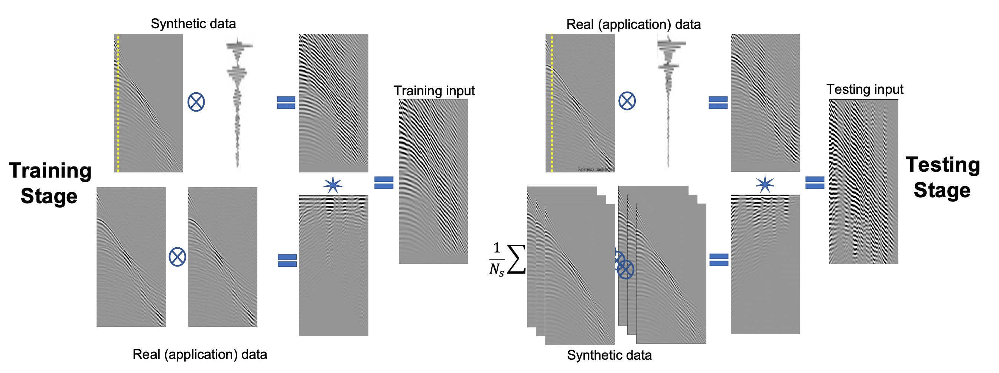

# MLReal: Bridging the gap between training on synthetic data and real data applications in machine learning

This repository accompanies publication [[Alkhalifah, Wang and Ovcharenko, 2021]](https://arxiv.org/abs/2109.05294) and provides forward / backword methods for MLReal transformation in application to the task of low-frequency data extrapolation.




## How to start
Download the data and run notebooks. All notebooks are set for inference / view by default. Meaning that these will not run any heavy calculations unless reset otherwise. Instead, these will use the pre-trained weights and data to partially reproduce results from the paper.


| Filename | Description |
| -------- | ---- |
| ex0_create_training_dataset.ipynb | Generate training dataset of synthetic waveforms | 
| ex1_multi.ipynb | Train Multi-column network to predict low-frequency data |
| ex2_mlreal_forw.ipynb | Same as ex1 but with MLReal applied to inputs only |
| ex3_mlreal_forw_back.ipynb | Same as ex1 but with MLReal applied to both inputs and targets |
| shared_data_loading.ipynb | Shared data loading snippets |
| assets | Folder with images for README| 
| pretrained_files | Download and place pre-trained data here | 
| utils |  Code components | 

### Prerequsites and dependencies
* Python 3.8
* PyTorch 1.8
* CUDA 11.0

For the rest of Python dependencies check `requirements.txt`.

### Installation
```
git clone https://github.com/swag-kaust/mlreal.git
cd mlreal/
python -m venv env
source env/bin/activate
pip install -r requirements.txt

jupyter notebook .
```

### Downloads
Unzip files by running `tar -xvf arhive.tar.gz` and place complete folders according to the table

| Link | Size | Destination | Description
| ---- | -----| ------------| ----------- |
| [data.tar.gz](https://www.dropbox.com/s/58zckalcm6wlp06/data.tar.gz?dl=1) | ~ 13 Gb | `./pretrained_files/data/*` | training and validation datasets
| [trained_nets.tar.gz](https://www.dropbox.com/s/gmry3trrlu3gerg/trained_nets.zip?dl=1) | ~ 300 Mb| `./pretrained_files/trained_nets/*` | Pre-trained network weights

## Acknowledgments
Our implementation is heavily influenced and contains code blocks from [Inpainting GMCNN](https://github.com/shepnerd/inpainting_gmcnn).

## Citation
```
@misc{alkhalifah2021mlreal,
      title={MLReal: Bridging the gap between training on synthetic data and real data applications in machine learning}, 
      author={Tariq Alkhalifah and Hanchen Wang and Oleg Ovcharenko},
      year={2021},
      eprint={2109.05294},
      archivePrefix={arXiv},
      primaryClass={physics.geo-ph}
```